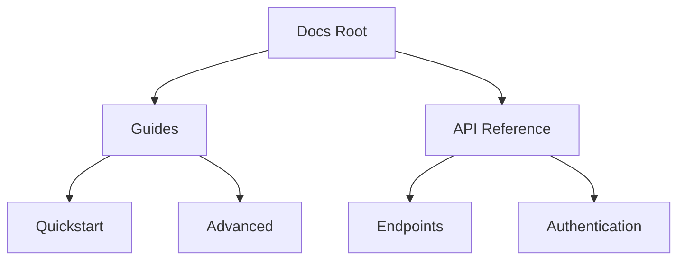

## Overview

Seven provides powerful tools to streamline your documentation workflow. You organize content into intuitive hierarchies, edit with flexible formatting options, track changes via version control, and navigate efficiently with advanced search. These features ensure your project docs stay current and accessible.

<Callout kind="info">
  Start by creating your first document space to experience these features hands-on.
</Callout>

## Document Organization and Hierarchies

Build structured documentation with nested folders and pages. You create unlimited hierarchies to mirror your project's architecture, from high-level overviews to detailed API references.

<Columns cols={3}>
  <Card title="Nested Folders" icon="folder" href="#">
    Organize docs into unlimited subfolders for clear navigation.
  </Card>
  <Card title="Page Linking" icon="link" href="#">
    Link pages seamlessly with relative paths like `{./subpage.mdx}`.
  </Card>
  <Card title="Custom Navigation" icon="menu" href="#">
    Generate dynamic sidebars from your folder structure.
  </Card>
</Columns>



This flowchart shows a typical hierarchy you can implement.

## Editing and Formatting Options

Edit documents using Markdown, MDX, or visual editors. You access rich formatting like tables, code blocks, and embeds directly in the interface.

<Tabs>
  <Tab title="Markdown" icon="code">
    Write standard Markdown with full syntax support.

    ```markdown
    # Heading

    - List item
    - Another item

    | Feature | Benefit |
    |---------|---------|
    | Hierarchies | Easy navigation |
    | Versioning | Track changes |
    ```

  </Tab>
  <Tab title="MDX Components" icon="components">
    Embed interactive components for richer docs.

    <CodeGroup tabs="Callout,Steps">
    ````jsx
    <Callout kind="tip">
      This is a tip.
    </Callout>
    ````
    ````jsx
    <Steps>
      <Step title="Step 1">Do this.</Step>
    </Steps>
    ````
    </CodeGroup>
  </Tab>
  <Tab title="Visual Editor" icon="edit-3">
    Drag-and-drop interface for non-technical users. Toggle between source and preview modes.
  </Tab>
</Tabs>

## Version Control for Docs

Integrate with Git for seamless version control. You commit changes, create branches, and merge updates without leaving the editor.

<Steps>
  <Step title="Connect Repository" icon="git-branch">
    Link your GitHub repo to Seven.

    ````bash
    git remote add origin https://github.com/your-org/seven-docs.git
    git push -u origin main
    ````
  </Step>
  <Step title="Commit Changes" icon="git-commit">
    Edit docs and commit directly.

    <CodeGroup tabs="CLI,UI">
    ````bash
    git add .
    git commit -m "Update features guide"
    git push
    ````
    ````bash
    # Use Seven's built-in UI
    # Click "Commit" after edits
    ````
    </CodeGroup>
  </Step>
  <Step title="Review History" icon="history">
    View diffs and revert changes via the version panel.
  </Step>
</Steps>

<Callout kind="tip">
  Enable branch protection to prevent accidental publishes.
</Callout>

## Search and Navigation Tools

Find content instantly with full-text search across your docs. Navigation includes breadcrumbs, table of contents, and global search.

| Tool | Description | Shortcut |
|------|-------------|----------|
| Global Search | Fuzzy search all docs | `<kbd>Ctrl</kbd>+<kbd>K</kbd>` |
| Page TOC | Auto-generated sidebar | `<kbd>Ctrl</kbd>+<kbd>T</kbd>` |
| Breadcrumbs | Path-based navigation | Always visible |

<Expandable title="Advanced Search Filters" default-open="false">
  Filter by tags, dates, or authors. Example query: `features since:2024-01-01 tag:guide`.
</Expandable>

These tools keep you productive. Explore [quickstart](/quickstart) next for setup.