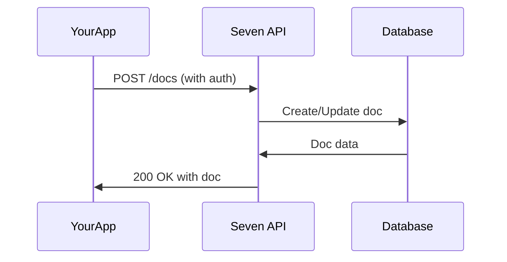

## Overview

Connect Seven to your favorite tools to automate workflows, sync content, and extend functionality. You can integrate with third-party apps, set up webhooks for real-time notifications, handle exports and imports in various formats, and build custom solutions using the API.

<Callout kind="info">
Seven supports seamless connections to popular services. Start with pre-built integrations or use webhooks and API for advanced automation.
</Callout>

## Third-Party App Connections

Seven offers native integrations with popular tools. Use these to sync documentation, trigger builds, or notify teams.

<Columns cols={3}>
  <Card title="Slack" icon="message-circle" href="https://slack.com" target="_blank">
    Send update notifications to Slack channels when docs change.
  </Card>
  <Card title="GitHub" icon="github" href="https://github.com" target="_blank">
    Automatically sync docs with GitHub repos for version control.
  </Card>
  <Card title="Zapier" icon="zap" href="https://zapier.com" target="_blank">
    Create no-code automations with 5000+ apps via Zapier.
  </Card>
</Columns>

To enable an integration, navigate to your Seven dashboard at `https://dashboard.example.com/settings/integrations`, select the app, and authorize access.

## Setting Up Webhooks for Automation

Webhooks let external services receive real-time events from Seven, such as doc updates or publishes.

<Steps>
  <Step title="Create Webhook" icon="plus">
    Go to `https://dashboard.example.com/settings/webhooks` and click "New Webhook".
  </Step>
  <Step title="Configure Endpoint" icon="link">
    Enter your webhook URL, like `https://your-webhook-url.com/seven-events`.
    
    Select events: `doc.updated`, `doc.published`.
  </Step>
  <Step title="Test and Save" icon="check-circle">
    Send a test event and verify receipt.
    
````javascript
// Example test payload
{
  "event": "doc.updated",
  "doc_id": "doc_123abc",
  "timestamp": "2024-01-15T10:30:00Z"
}
````
  </Step>
</Steps>

<Callout kind="tip">
Use secret tokens for signature verification. Compare `X-Seven-Signature` header with HMAC SHA-256 of the payload using your webhook secret.
</Callout>

## Export and Import Functionalities

Export your documentation for backups or sharing, and import from other formats to migrate content.

<Tabs>
  <Tab title="Export" icon="download">
    From the dashboard, select "Export" and choose format.
    
    ```bash
    curl -H "Authorization: Bearer YOUR_API_KEY" \
         https://api.example.com/v1/docs/export \
         -d '{"format": "markdown", "doc_id": "doc_123abc"}'
    ```
    
    Formats: Markdown, PDF, HTML.
  </Tab>
  <Tab title="Import" icon="upload">
    Upload files via dashboard or API.
    
    ```bash
    curl -X POST -H "Authorization: Bearer YOUR_API_KEY" \
         https://api.example.com/v1/docs/import \
         -F "file=@docs.md" \
         -F "format=markdown"
    ```
  </Tab>
</Tabs>

## Custom API Integrations

Build tailored solutions using Seven's REST API at `https://api.example.com/v1`.

<ParamField path="doc_id" param-type="string" required="true">
  Unique document identifier.
</ParamField>

<ParamField header="Authorization" param-type="string" required="true">
  Bearer `{YOUR_API_KEY}`.
</ParamField>

<CodeGroup tabs="JavaScript,cURL">
  ```javascript
  const response = await fetch('https://api.example.com/v1/docs/doc_123abc', {
    headers: {
      'Authorization': `Bearer ${YOUR_API_KEY}`
    }
  });
  const doc = await response.json();
  console.log(doc.title);
  ```
  ```bash
  curl -H "Authorization: Bearer YOUR_API_KEY" \
       https://api.example.com/v1/docs/doc_123abc
  ```
</CodeGroup>



## Next Steps

Explore these resources to deepen your integrations:

<Columns cols={2}>
  <Card title="API Reference" icon="book-open" href="/authentication">
    Full endpoint details and auth.
  </Card>
  <Card title="Webhook Events" icon="bell" href="#">
    Complete list of event types.
  </Card>
</Columns>